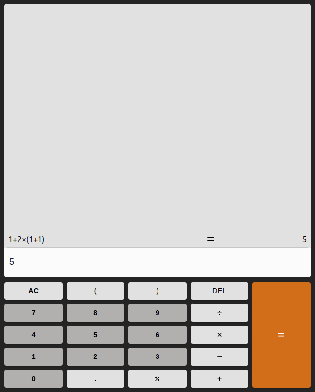

# Calculator
# React + TypeScript + Vite

This project is a clone of a simple calculator that can evaluate basic mathematical expressions. The app validates the expression format and performs the calculation without relying on any external libraries.

## Run the app
```js
npm run dev
```

## Screenshot

